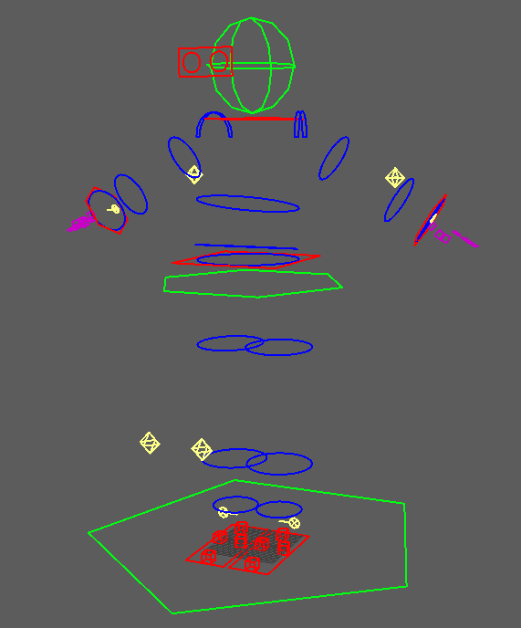

# 概要

キャラクターのリギングについて学ぶ目的で制作したパッケージです。

# 設計について
ただ一連の処理を羅列するのではなく、インターフェースを活用しました。

インターフェースを活用したのは以下の目的からです。

#### 特定の機能に依存せず、拡張・変更に対して強くする。

- 変更に対する改修範囲を狭くすることで、時間短縮と不具合発生時の影響範囲を限定できます。
- 案件や開発都合により、ジョイントやリグの作りは常に変わります。今後の保守・アップデートのコストを下げることができます。
  - 例えば、骨はCharacter Creator由来ですが、別の物にした場合でも最低限の書き換えで済むように作りました。

#### 実装を気にしないようにする。

- インターフェースを通しての入力・出力・するべき動作が正しければ、実装はどうなっていようと構いません。
- とりあえず動くものをつくって、後からデバック・修正するのを容易にします。

※注意 
インターフェースが絶対に書き変わらないわけではありません。必要に応じて、メソッド・パラメーターが増えるでしょう。

# フォルダ構成について

RigSample 
├───Character 
│   └───Reallusion 
├───CharacterRig 
│   └───ReallusionRig 
├───Maya 
├───RigSetup 
│   └───Reallusion 
└───Main.py

| フォルダ・py                    | 概要                                          |
|----------------------------|---------------------------------------------|
| Character                  | スケルトンの情報を扱うクラスが格納されています。                    |
| Character/Reallusion       | CharacterCreatorのジョイントを定義した具象クラスを格納。        |
| CharacterRig               | リグ情報を扱うクラスを格納するフォルダ。                        |
| CharacterRig/ReallusionRig | CharacterCreator向けに試作したカスタムリグを定義した具象クラスを格納。 |
| Maya                       | サンプルシーン、リグシーンを格納するフォルダ。                     |
| RigSetup                   | ジョイント・リグクラスを参照してリギングを実際に行うクラスを格納。           |
| RigSetup/Reallusion        | 試作したカスタムリグのリギングのロジックを定義した具象クラスを格納。          |
| Main.py                    | リグのセットアップを実行するpyファイル。依存関係の定義もここで行う。         |

# コントローラの作り方について

リギング時、Maya/Rig.maにあるコントローラを参照として読み込みます。
別シーンでコントローラの構成を決めることで、手を動かしながら最適なコントローラ配置・デザインを確認できます。

# リグのギミックについて

現在作っているギミックは以下の通りです。

- 腕・脚のツイストエクスプレッション設定
- 腕Ik・Fk
- 脚Ik・Fk
- SpineIk・Fk
  - body_ctrlに切り替えのためのアトリビュートがあります。
- エイムIk
- リバースフット

# アセットについて
キャラクターはCharacter Creator4で制作したものを使用しています。

# 使い方

1. Mayaのscriptsフォルダ以下にこのツールを配置してください。
2. Maya/Sample.maを開いてください。
3. Main.pyをスクリプトエディタから実行してください。これでリグのセットアップは完了です。
